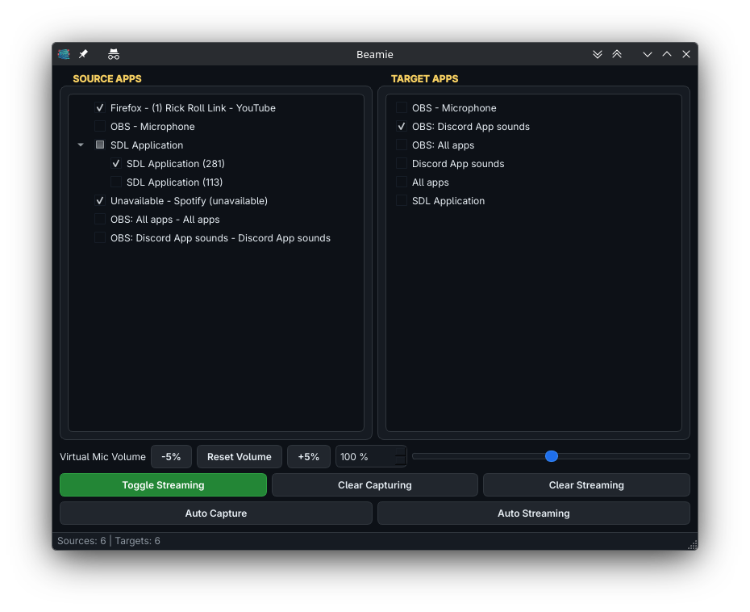

# Beamie



Beamie is a modern PyQt6-based PipeWire desktop router and media streamer. It couples interactive application audio routing with virtual microphone management using native **PipeWire routing engines**.

## Features

- **PipeWire Audio Routing**: Stream audio dynamically from any running application (source) to other applications or recording targets cleanly under Wayland/X11.
- **Virtual Microphone Management**: Automates the creation and teardown of virtual audio devices, offering a virtual microphone loopback interface.
- **Dynamic Device Volume Adjustments**: Adjust virtual microphone volume dynamically up to 200% via UI spinbox and sliders.
- **Auto Capture & Streaming Mode**: Automatic selection & background sync of routing links according to your custom application lists.
- **Elegant Dark Theme**: A dark mode interface matching your modern desktop layout.
- **State Persistence**: Configuration is automatically saved and initialized.

---

## Installation & Setup

Beamie requires PyQt6 and PipeWire utilities (`pw-dump`, `pw-link`, `pw-cli`, `pactl`).

Ensure you have the required system and Python dependencies installed. We recommend using `uv` to manage environment requirements:

```bash
# Run developer mode via uv
uv run main.py
```

---

## How to Build & Install Standalone Application

### 1. Compile into stand-alone binary:
Execute the bundle shell script which creates a single binary of Beamie with built-in asset dependencies and the custom launcher icon styling:
```bash
./build.sh
```
This produces the standalone binary at: `./dist/beamie`

### 2. Install to system:
Move the compiled application to your system binary directory (requires sudo write permission):
```bash
sudo cp dist/beamie /usr/local/bin/
```

### 3. Register Desktop Desktop Entry Launcher:
Register the launcher and copy the application layout icons to desktop search indexes:
```bash
./register-app.sh
```

---

## Configuration directory

Configurations are stored as JSON files:
- Primary: `$HOME/.config/beamie/config.json`
- Fallback: `$HOME/.beamie/config.json`
